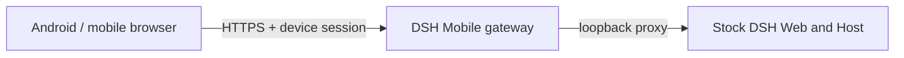

<p align="center">
  
</p>

<h1 align="center">DSH Mobile</h1>

<p align="center">Secure, live LAN access to DeepSeek Harness from a phone.</p>

<p align="center">
  <a href="https://www.npmjs.com/package/dsh-mobile"></a>
  <a href="https://github.com/saya-ch/dsh-mobile/actions/workflows/ci.yml"></a>
  <a href="https://github.com/saya-ch/dsh-mobile/releases"></a>
  <a href="LICENSE"></a>
</p>

<p align="center"><a href="README.md">简体中文</a></p>

> Alpha software. Android is the only supported native app; the iOS client remains an unpublished local experiment and is not built or released. This is a community plugin, not an official DeepSeek product.

<p align="center"><a href="https://github.com/saya-ch/dsh-mobile/releases"><strong>Download the Android app</strong></a></p>

DSH Mobile is a DeepSeek Harness plugin that lets a mobile browser or the Android app connect over a protected LAN and keep using the same sessions, Workspaces, messages, and tools. It is a mobile entry point only; the DeepSeek Harness source is not modified and no public-Internet tunneling is needed.

It can also edit the phone page directly from a DeepSeek Harness conversation: change the mobile layout, interactions, or features, and open pages refresh within a few seconds.

## Quick start

With an installed `dsh` command:

```powershell
dsh plugin --profile web add dsh-mobile@alpha
dsh plugin --profile web exec dsh-mobile setup
dsh --profile web
```

From a DeepSeek Harness source checkout:

```powershell
corepack enable; pnpm install
pnpm dsh plugin --profile web add dsh-mobile@alpha
pnpm dsh plugin --profile web exec dsh-mobile setup
pnpm dsh --profile web
```

After starting DSH, open **Mobile Access** in the lower-left sidebar, then:

1. Select **Create and copy key** or **Copy pairing link**; the panel shows a pairing QR code.
2. In the Android app, tap **Scan QR code** and point the camera at the screen — or tap **Scan**, select the computer, and paste the key or pairing link.
3. Pairing establishes persistent device trust; later launches do not ask again.

`setup` automatically selects and remembers the current LAN; Wi-Fi, hotspot, and IP changes normally recover without re-pairing. Use `--address 192.168.x.x` only when automatic selection fails. Settings, certificates, devices, and customization files live under `$DSH_HOME/mobile-access/`.

## What it does

- **Continue DSH work from a phone**: the same sessions, Workspaces, messages, and tools, in real time.
- **Customize the phone UI by talking to DSH**: change the mobile layout, interactions, and features from a conversation; open pages refresh within seconds.
- **A dedicated touch layout**: session drawer, tool details, settings, and composer reorganized for phones.
- **Auto-discovery, no re-pairing**: Wi-Fi, hotspot, or IP changes normally recover automatically.
- **Three pairing options**: scan a QR code, paste a pairing link, or enter a key.

A paired device is fully trusted and can operate the DSH on the computer. Use this only on a trusted home or office LAN, or a trusted VPN.

## App or mobile browser

| Client | Best for | Notes |
| --- | --- | --- |
| Android app | Everyday use | Auto-discovery; private certificate pinning inside the app, no manual browser trust step |
| Mobile browser | Temporary or cross-platform | Open the HTTPS origin shown by Mobile Access; trust the certificate manually on first visit |

The Android app is a thin Kotlin WebView shell and contains no frontend copy; mobile browsers load the same page. For compatibility diagnosis, append `?frontend=stock` to the browser URL to temporarily use the previous desktop-page adaptation.

## Extend and customize

You don't need to touch any files: type `/mobile <what you want>` in a DSH conversation, and DSH makes the change — the phone client updates within a few seconds. No need to know paths or formats.

Two layers are customizable, both under `$DSH_HOME/mobile-access/`:

- **Interface and interactions**: `mobile.css` and `mobile.js`.
- **Computer-side capabilities**: extensions under `extensions/`; `host.mjs` runs on the computer, letting the phone reach computer files, programs, or hardware. The phone cannot modify these files.

> `host.mjs` has the desktop user's Node.js privileges and is not sandboxed — install and edit only extensions you trust.

## How it works



Three layers: the Host face for discovery, pairing, HTTPS, loopback proxying, and extension registration; the Client face for the dedicated mobile layout and extension SDK; and the Android app for a narrow native bridge. Neither the DeepSeek Harness source nor its desktop page on port 3080 is modified.

## Security

- Use the plugin only on a trusted LAN or trusted VPN; never expose it to the public Internet.
- A paired device is a fully trusted DeepSeek Harness operator and can run tools on the computer; revoke lost devices from the computer.
- The LAN gateway listens only while Mobile Access is enabled; with it off, DSH keeps running normally on the computer.

See [SECURITY.md](SECURITY.md).

## Compatibility

| DSH Mobile | Verified DeepSeek Harness releases |
| --- | --- |
| `0.1.0-alpha.32` | `0.1.0-rc.5`, `0.1.0-rc.6`, `0.1.0-rc.7` |

At startup, the plugin verifies the DSH Host version and the frontend dependencies required by the mobile layout; an unverified release fails with a clear error instead of serving a broken page. CI also tracks the DSH main branch layout contract. If a DSH upgrade reports an incompatibility, update DSH Mobile first.

## Uninstall

```powershell
dsh plugin --profile web remove dsh-mobile
```

To remove local plugin data first:

```powershell
dsh plugin --profile web exec dsh-mobile purge --yes
dsh plugin --profile web remove dsh-mobile
```

Source users replace `dsh` with `pnpm dsh`.

## Development

```powershell
npm ci
npm run verify
```

See the [Android guide](apps/mobile/README.md). Licensed under [Apache-2.0](LICENSE).
