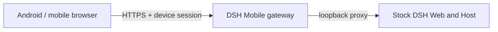

<p align="center">
  
</p>

<h1 align="center">DSH Mobile</h1>

<p align="center">Secure, live LAN access to DeepSeek Harness from a phone.</p>

<p align="center">
  <a href="https://www.npmjs.com/package/dsh-mobile"></a>
  <a href="https://github.com/saya-ch/dsh-mobile/actions/workflows/ci.yml"></a>
  <a href="https://github.com/saya-ch/dsh-mobile/releases"></a>
  <a href="LICENSE"></a>
  <a href="https://github.com/awesome-dsh-plugin/awesome-dsh-plugin"></a>
</p>

<p align="center"><a href="README.md">简体中文</a></p>

> The native app currently supports Android only; the iOS client remains a local experiment and is not included in builds or releases. This is a DeepSeek Harness community plugin.
>
> This release adds compatibility with DeepSeek Harness 0.1.1 and improves mobile interaction and layout.

<p align="center"><a href="https://github.com/saya-ch/dsh-mobile/releases"><strong>Download the Android app</strong></a></p>

DSH Mobile is a DeepSeek Harness plugin that lets a mobile browser or the Android app connect over a protected LAN and keep using the same sessions, Workspaces, messages, and tools. It is a mobile entry point only; the DeepSeek Harness source is not modified and no public-Internet tunneling is needed.

Mobile access runs on its own HTTPS origin with pinned certificates; only paired devices pass validation.

It also lets you customize the phone from a DSH conversation: `/mobile <what you want>`.

## What it does

- **Continue DSH work from a phone**: the same sessions, Workspaces, messages, and tools, in real time.
- **Customize the phone UI by talking to DSH**: change the mobile layout, interactions, and features from a conversation; open pages refresh within seconds.
- **A dedicated touch layout**: session drawer, tool details, settings, question cards, and composer reorganized for phones.
- **Auto-discovery, no re-pairing**: Wi-Fi, hotspot, or IP changes normally recover automatically.
- **Three pairing options**: scan a QR code, paste a pairing link, or enter a key.

A paired device is fully trusted and can operate the DSH on the computer. Use this only on a trusted home or office LAN, or a trusted VPN.

## Quick start

With an installed `dsh` command:

```powershell
dsh plugin --profile web add dsh-mobile@latest
dsh plugin --profile web exec dsh-mobile setup
dsh --profile web
```

From a DeepSeek Harness source checkout:

```powershell
corepack enable; pnpm install
pnpm dsh plugin --profile web add dsh-mobile@latest
pnpm dsh plugin --profile web exec dsh-mobile setup
pnpm dsh --profile web
```

Or via the plugin market (optional):

```powershell
dsh plugin --profile web add dshmarket
```

Restart DSH, then search for **dsh-mobile** under **Settings → Plugin Market** and install it with one click.

After starting DSH, open **Mobile Access** in the lower-left sidebar, then:

1. Select **Create and copy key** or **Copy pairing link**; the panel shows a pairing QR code.

<p align="center">
  
</p>

2. In the Android app, tap **Scan QR code** and point the camera at the screen — or tap **Scan**, select the computer, and paste the key or pairing link.
3. Pairing establishes persistent device trust; later launches do not ask again.

`setup` automatically selects and remembers the current LAN; Wi-Fi, hotspot, and IP changes normally recover without re-pairing. Use `--address 192.168.x.x` only when automatic selection fails. Settings, certificates, devices, and customization files live under `$DSH_HOME/mobile-access/`.

## Extend and customize

Type `/mobile <what you want>` in a DSH conversation, and DSH edits the phone client's files for you; changes apply within a few seconds. For example:

```text
/mobile turn the phone UI into an old CRT terminal, with messages scrolling like terminal output
```

It can also drive computer capabilities the phone can use, like reading the machine's live state:

```text
/mobile give the phone a cyberpunk-style computer monitor panel that shows live CPU, memory, and disk usage
```

Two kinds of changes are supported: the phone UI itself (theme, layout, buttons), and computer capabilities the phone can use (browsing computer files, running programs on the computer). `/mobile` hands the request to the DSH agent, which edits files under the local DSH configuration directory (`$DSH_HOME/mobile-access/`); the phone client applies them automatically. UI changes live in `mobile.css`/`mobile.js`. Computer capabilities come from extensions under `extensions/`, whose `host.mjs` runs with the local user's privileges on the computer. DeepSeek Harness source is not modified.

> When using computer-side capabilities, use only content you trust.

The examples above, applied:

<p align="center">
  
  
  
  
</p>

## App or mobile browser

| Client | Best for | Notes |
| --- | --- | --- |
| Android app | Everyday use | Auto-discovery; private certificate pinning inside the app, no manual browser trust step |
| Mobile browser | Temporary or cross-platform | Open the HTTPS origin shown by Mobile Access; trust the certificate manually on first visit |

The Android app is a thin Kotlin WebView shell and contains no frontend copy; mobile browsers load the same page. For compatibility diagnosis, append `?frontend=stock` to the browser URL to temporarily use the previous desktop-page adaptation.

## How it works



Three layers: the Host face for discovery, pairing, HTTPS, loopback proxying, and extension registration; the Client face for the dedicated mobile layout and extension SDK; and the Android app for a narrow native bridge. Neither the DeepSeek Harness source nor its desktop page on port 3080 is modified.

## Security

- Use the plugin only on a trusted LAN or trusted VPN; never expose it to the public Internet.
- A paired device is a fully trusted DeepSeek Harness operator and can run tools on the computer; revoke lost devices from the computer.
- The LAN gateway listens only while Mobile Access is enabled; with it off, DSH keeps running normally on the computer.

See [SECURITY.md](SECURITY.md).

## Compatibility

| DSH Mobile | Verified DeepSeek Harness releases |
| --- | --- |
| `0.1.0–0.1.2` | `0.1.0-rc.5`, `0.1.0-rc.6`, `0.1.0-rc.7`, `0.1.1-rc.2` |

At startup, the plugin verifies the DSH Host version and the frontend dependencies required by the mobile layout; an unverified release fails with a clear error instead of serving a broken page. CI also tracks the DSH main branch layout contract. If a DSH upgrade reports an incompatibility, update DSH Mobile first.

## Uninstall

```powershell
dsh plugin --profile web remove dsh-mobile
```

To remove local plugin data first:

```powershell
dsh plugin --profile web exec dsh-mobile purge --yes
dsh plugin --profile web remove dsh-mobile
```

Source users replace `dsh` with `pnpm dsh`.

## Development

```powershell
npm ci
npm run verify
```

See the [Android guide](apps/mobile/README.md). Licensed under [Apache-2.0](LICENSE).
