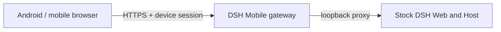

<p align="center">
  
</p>

<h1 align="center">DSH Mobile</h1>

<p align="center">Secure, live LAN access to DeepSeek Harness from a phone.</p>

<p align="center">
  <a href="https://www.npmjs.com/package/dsh-mobile"></a>
  <a href="https://github.com/saya-ch/dsh-mobile/actions/workflows/ci.yml"></a>
  <a href="https://github.com/saya-ch/dsh-mobile/releases"></a>
  <a href="LICENSE"></a>
</p>

<p align="center"><a href="README.md">简体中文</a></p>

> Alpha software. Android is the only native app. This is a community plugin, not an official DeepSeek product.

<p align="center"><a href="https://github.com/saya-ch/dsh-mobile/releases"><strong>Download the Android app</strong></a></p>

DSH Mobile provides a dedicated phone layout that composes the native DeepSeek Harness conversation, Workspace, settings, and plugin components. An authenticated HTTPS LAN gateway keeps desktop, Android, and mobile browsers on the same Workspaces, sessions, messages, tools, settings, and event streams.

## Quick start

With an installed `dsh` command:

```powershell
dsh plugin --profile web add dsh-mobile@alpha
dsh plugin --profile web exec dsh-mobile setup
dsh --profile web
```

From a DeepSeek Harness source checkout:

```powershell
corepack enable; pnpm install
pnpm dsh plugin --profile web add dsh-mobile@alpha
pnpm dsh plugin --profile web exec dsh-mobile setup
pnpm dsh --profile web
```

`setup` automatically selects and remembers the current LAN. Wi-Fi, hotspot, and IP changes normally recover automatically; use `--address 192.168.x.x` only when automatic selection fails.

Open **Mobile Access** in the lower-left DeepSeek Harness sidebar, enable it, and select **Create and copy key**. In the Android app, tap **Scan**, select the computer, and enter the key. The paired device remains trusted until it is revoked, expires, or its app data is cleared.

## Connection options

| Client | Best for | Notes |
| --- | --- | --- |
| Android app | Everyday use | Automatic discovery, no browser chrome, private certificate pinning |
| Mobile browser | Temporary or cross-platform access | Open the HTTPS origin shown by Mobile Access |

Discovery uses mDNS/NSD, UDP announcements and queries, plus HTTPS probing. It publishes only the device name, address, port, protocol version, and stable `instanceId`. Keys and device tokens are never discoverable. IP changes do not require another Android pairing.

For a browser's first connection, open pairing on the computer, generate a key, then visit `/mobile-access/pair` on the shown HTTPS origin and enter the 43-character pairing code after the key's final dot. The browser stores a revocable device credential after pairing.

## Mobile UI

Phones use a dedicated layout shell, so the main layout no longer depends on the desktop three-column DOM. Native feature components retain a small mobile adaptation layer. You can freely redesign the page structure and extend its interactions through **Customize from DeepSeek Harness**. By default, the session sidebar becomes a drawer, details open as an overlay, settings use a single-column layout, and the native composer is adapted for touch. Adding a Workspace browses computer folders inside the phone page. Images can come from the phone or the computer.

The Android app is a thin Kotlin WebView shell and contains no frontend copy.

For compatibility diagnosis, append `?frontend=stock` to the browser URL to temporarily use the previous desktop-page adaptation.

## Customize from DeepSeek Harness

Customization is intentionally open-ended: use your own ideas to arrange the mobile layout, interactions, and features instead of staying within the default style.

Ask DeepSeek Harness to edit:

```text
$DSH_HOME/mobile-access/mobile.css
$DSH_HOME/mobile-access/mobile.js
```

Changes are applied to open Android and browser pages in about one second. Customization is not limited to colors: `mobile.js` can add navigation, shortcuts, dashboards, camera, voice, scanning, and complete interactions with same-origin DeepSeek Harness APIs.

## How it works



The Host face owns discovery, pairing, HTTPS, and the proxy. The Client face replaces only the phone layout entry while reusing native feature plugins. Neither the DeepSeek Harness source nor its desktop page on port 3080 is modified.

## Compatibility

| DSH Mobile | Verified DeepSeek Harness releases |
| --- | --- |
| `0.1.0-alpha.21` | `0.1.0-rc.5`, `0.1.0-rc.6` |

At startup, the plugin verifies the DSH Host version and the frontend dependencies required by the mobile layout. An unverified release fails with a clear error instead of serving a broken page. CI also tracks the DSH main branch layout slots and mobile semantic markers. If a DSH upgrade reports an incompatibility, update DSH Mobile first.

## Security

Use the plugin only on a trusted LAN or trusted VPN. Never expose it directly to the public Internet. A paired device is a fully trusted DeepSeek Harness operator. Revoke lost devices from the computer. See [SECURITY.md](SECURITY.md).

## Uninstall

```powershell
dsh plugin --profile web remove dsh-mobile
```

To remove local plugin data first:

```powershell
dsh plugin --profile web exec dsh-mobile purge --yes
dsh plugin --profile web remove dsh-mobile
```

Source users replace `dsh` with `pnpm dsh`.

## Development

```powershell
npm ci
npm run verify
```

See the [Android guide](apps/mobile/README.md). Licensed under [Apache-2.0](LICENSE).
