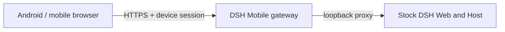

<p align="center">
  
</p>

<h1 align="center">DSH Mobile</h1>

<p align="center">Secure, live LAN access to DeepSeek Harness from a phone.</p>

<p align="center">
  <a href="https://www.npmjs.com/package/dsh-mobile"></a>
  <a href="https://github.com/saya-ch/dsh-mobile/actions/workflows/ci.yml"></a>
  <a href="https://github.com/saya-ch/dsh-mobile/releases"></a>
  <a href="LICENSE"></a>
</p>

<p align="center"><a href="README.md">简体中文</a></p>

> Alpha software. Android is the only supported native app; the iOS client remains an unpublished local experiment and is not built or released. This is a community plugin, not an official DeepSeek product.

<p align="center"><a href="https://github.com/saya-ch/dsh-mobile/releases"><strong>Download the Android app</strong></a></p>

DSH Mobile is a DeepSeek Harness plugin that lets a mobile browser or the Android app connect over a protected LAN and keep using the same sessions, Workspaces, messages, and tools. It is a mobile entry point only; the DeepSeek Harness source is not modified.

## What it does

- Continue DSH work from a phone: sessions, tools, settings, and live state stay in sync.
- Edit the mobile layout, interactions, and features directly through a DeepSeek Harness conversation; open phone pages usually refresh within a few seconds — customize your mobile client by talking to DSH, not by writing code.
- A dedicated touch layout: session drawer, tool details, settings, and composer are reorganized for touch.
- Auto-discovery on the LAN; Wi-Fi, hotspot, or IP changes normally recover without re-pairing.
- Pair by scanning a QR code, pasting a pairing link, or entering a key — no 43-character key to type.

## Quick start

With an installed `dsh` command:

```powershell
dsh plugin --profile web add dsh-mobile@alpha
dsh plugin --profile web exec dsh-mobile setup
dsh --profile web
```

From a DeepSeek Harness source checkout:

```powershell
corepack enable; pnpm install
pnpm dsh plugin --profile web add dsh-mobile@alpha
pnpm dsh plugin --profile web exec dsh-mobile setup
pnpm dsh --profile web
```

`setup` automatically selects and remembers the current LAN. Wi-Fi, hotspot, and IP changes normally recover automatically; use `--address 192.168.x.x` only when automatic selection fails.

After starting DSH, open **Mobile Access** in the lower-left sidebar, enable it, then:

1. Select **Create and copy key** or **Copy pairing link**; the panel shows a pairing QR code.
2. In the Android app, tap **Scan QR code** and point the camera at the screen — or tap **Scan**, select the computer, and paste the key or pairing link.
3. Pairing establishes persistent device trust; later launches do not ask again.

A paired device is fully trusted and can operate the DSH on the computer. Use this only on a trusted home or office LAN, or a trusted VPN.

The plugin does not modify the DeepSeek Harness source. Settings, certificates, devices, and customization files live under `$DSH_HOME/mobile-access/`.

## App or mobile browser

| Client | Best for | Notes |
| --- | --- | --- |
| Android app | Everyday use | Auto-discovery; private certificate pinning inside the app, no manual browser trust step |
| Mobile browser | Temporary or cross-platform | Open the HTTPS origin shown by Mobile Access; trust the certificate manually on first visit |

Discovery uses mDNS/NSD, UDP announcements and queries, plus HTTPS probing. It publishes only the device name, address, port, protocol version, and stable `instanceId` — never keys or device tokens. IP changes do not require another pairing.

For a browser's first connection, open pairing on the computer, then select **Copy pairing link** and open that link on the phone — the pairing code is prefilled. Alternatively, visit `/mobile-access/pair` on the shown HTTPS origin and enter the 43-character pairing code after the key's final dot. The browser stores a revocable device credential after pairing.

## Mobile UI

Phones use a dedicated layout shell that no longer depends on the desktop three-column DOM, while native components keep a small touch-adaptation layer:

- A workspace-and-session drawer opens from the top-left.
- Conversations, traces, tool details, and Session logs keep their full capabilities.
- Settings use top-level tabs and a single column.
- The composer keeps command, permission, model, context, image, and send controls.
- **Add Workspace** browses computer folders inside the phone page instead of opening a system picker on the computer.

The Android app is a thin Kotlin WebView shell and contains no frontend copy; mobile browsers load the same page. For compatibility diagnosis, append `?frontend=stock` to the browser URL to temporarily use the previous desktop-page adaptation.

## Customize from DeepSeek Harness

Default files:

```text
$DSH_HOME/mobile-access/mobile.css
$DSH_HOME/mobile-access/mobile.js
```

Ask DeepSeek Harness to edit them, for example:

```text
Edit $DSH_HOME/mobile-access/mobile.css and mobile.js to turn the mobile
client into a one-handed development console: add a bottom shortcut bar,
a session status panel, and a press-and-hold voice entry. Narrow screens only;
do not modify the DSH source.
```

Changes are applied to open Android and browser pages within a few seconds. Customization is not limited to colors: `mobile.js` can add navigation, shortcuts, dashboards, camera, voice, scanning, and complete interactions with same-origin DeepSeek Harness APIs.

## How it works



The Host face owns discovery, pairing, HTTPS, and the proxy. The Client face replaces only the phone layout entry while reusing native feature plugins. Neither the DeepSeek Harness source nor its desktop page on port 3080 is modified.

## Security

- Use the plugin only on a trusted LAN or trusted VPN; never expose it to the public Internet.
- A paired device is a fully trusted DeepSeek Harness operator and can run tools on the computer; revoke lost devices from the computer.
- The LAN gateway listens only while Mobile Access is enabled; with it off, DSH keeps running normally on the computer.

See [SECURITY.md](SECURITY.md).

## Compatibility

| DSH Mobile | Verified DeepSeek Harness releases |
| --- | --- |
| `0.1.0-alpha.30` | `0.1.0-rc.5`, `0.1.0-rc.6`, `0.1.0-rc.7` |

At startup, the plugin verifies the DSH Host version and the frontend dependencies required by the mobile layout. An unverified release fails with a clear error instead of serving a broken page. CI also tracks the DSH main branch layout slots and mobile semantic markers. If a DSH upgrade reports an incompatibility, update DSH Mobile first.

## Uninstall

```powershell
dsh plugin --profile web remove dsh-mobile
```

To remove local plugin data first:

```powershell
dsh plugin --profile web exec dsh-mobile purge --yes
dsh plugin --profile web remove dsh-mobile
```

Source users replace `dsh` with `pnpm dsh`.

## Development

```powershell
npm ci
npm run verify
```

See the [Android guide](apps/mobile/README.md). Licensed under [Apache-2.0](LICENSE).
