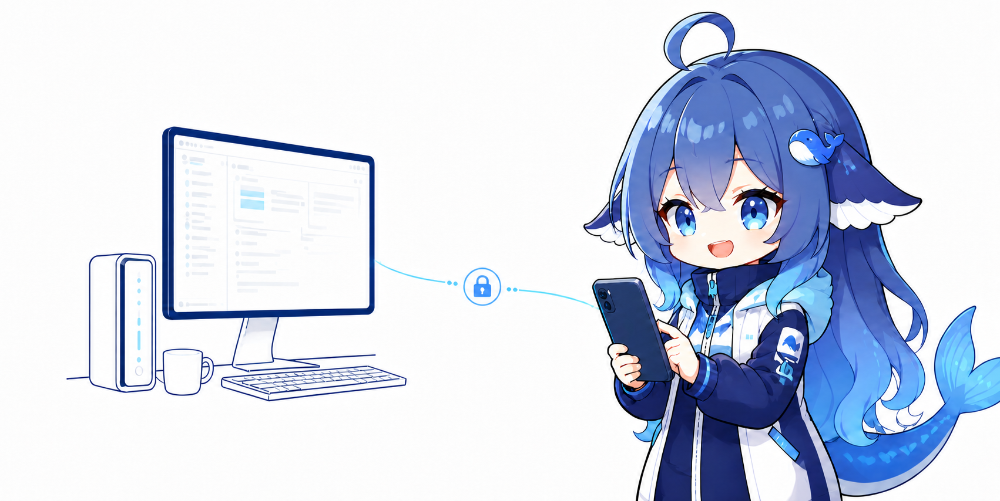
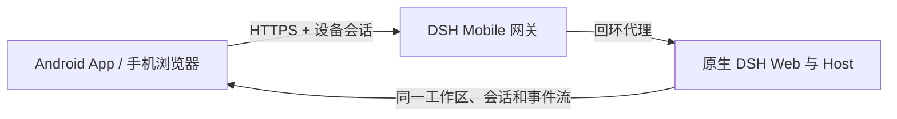

<p align="center">
  
</p>

<h1 align="center">DSH Mobile</h1>

<p align="center">在手机上安全、实时地使用电脑中的 DeepSeek Harness。</p>

<p align="center">
  <a href="https://www.npmjs.com/package/dsh-mobile"></a>
  <a href="https://github.com/saya-ch/dsh-mobile/releases"></a>
  
  <a href="LICENSE"></a>
</p>

<p align="center">
  <a href="#快速开始">快速开始</a> ·
  <a href="#连接方式">连接方式</a> ·
  <a href="#自定义移动布局与功能">自定义</a> ·
  <a href="README.en.md">English</a>
</p>

> Alpha 版本，当前原生 App 仅支持 Android。本项目是社区插件，不是 DeepSeek 官方产品。

<p align="center"><a href="https://github.com/saya-ch/dsh-mobile/releases"><strong>下载 Android App</strong></a></p>

DSH Mobile 不复制 DeepSeek Harness 前端。它为原生 React/Cordis 页面增加移动布局，并通过受保护的局域网 HTTPS 网关让 Android App 或手机浏览器访问同一份工作区、会话、消息和运行状态。

## 能做什么

- 实时控制电脑上的 DeepSeek Harness，会话和消息与桌面端同步。
- 复用原生对话、Markdown、工具卡、模型、设置、批准和已安装 UI 插件。
- 手机侧边栏、单列设置、移动输入栏和工具详情层。
- 从手机或电脑选择图片；添加工作区时在手机上浏览电脑目录。
- 自动发现局域网中的 DSH，IP 变化后按稳定设备标识更新地址。
- 直接在 DeepSeek Harness 对话中修改移动布局和功能，手机约一秒内实时刷新。

## 快速开始

已经安装 `dsh` 命令：

```powershell
dsh plugin --profile web add dsh-mobile
dsh plugin --profile web exec dsh-mobile setup
dsh --profile web
```

直接使用 DeepSeek Harness 源码：

```powershell
corepack enable; pnpm install
pnpm dsh plugin --profile web add dsh-mobile
pnpm dsh plugin --profile web exec dsh-mobile setup
pnpm dsh --profile web
```

`setup` 会根据系统默认路由自动选择真实的 Wi-Fi 或以太网，忽略常见 VPN、WSL、Docker 和代理虚拟网卡，并记住所选网卡。以后切换 Wi-Fi、手机热点或 DHCP 地址变化时，网关会自动重绑并沿用原有设备信任。只有系统确实无法区分两条真实局域网时，才需要追加 `--address 192.168.x.x`。

启动后：

1. 在 DeepSeek Harness 左下角打开“移动端”，确认移动访问已开启。
2. 点击“生成配对密钥”。
3. Android App 点击“扫描”，选择电脑并输入密钥。
4. 配对完成后会建立持久设备信任，以后打开 App 无需重复输入。

插件不会修改 DeepSeek Harness 源码。设置、证书、设备和自定义文件保存在 `$DSH_HOME/mobile-access/`。

## 连接方式

| 方式 | 适合场景 | 说明 |
| --- | --- | --- |
| Android App | 日常使用 | 自动发现、无浏览器栏、App 内私有证书固定 |
| 手机浏览器 | 临时或跨平台访问 | 打开“移动端”卡片显示的 HTTPS 地址 |

Android 同时使用 mDNS/NSD、UDP 公告、主动 UDP 查询和 HTTPS 探测发现 DeepSeek Harness。发现只广播设备名、地址、端口、协议版本和稳定 `instanceId`，不会广播密钥或令牌。

App 配对后保存可撤销的设备凭据和私有证书信任；Wi-Fi、热点或 DHCP 导致 IP 变化时不需要重新配对。手机浏览器不能使用 App 的私有信任，因此需要浏览器本身信任该 HTTPS 证书。

## 移动端界面

手机端仍然渲染原生 DeepSeek Harness 页面。插件提供轻量的默认移动适配；你也可以通过“自定义移动布局与功能”自由调整页面结构并扩展交互：

- 左上角打开工作区与会话抽屉。
- 对话、轨迹、工具详情和 Session log 保持原有能力。
- 设置页使用顶部分类和单列内容。
- 输入栏保留命令、权限、模型、上下文、图片和发送控件。
- “添加工作区”在手机上展示电脑目录，不会在电脑上弹系统选择器。

Android App 只是 Kotlin WebView 薄壳，不内置另一份网页。手机浏览器访问的也是同一页面。

## 自定义移动布局与功能

自定义程度很高：你可以发挥创意，自由布置移动端的布局、交互和功能，而不必局限于默认样式。

直接在 DeepSeek Harness 对话中提出修改即可。默认文件：

```text
$DSH_HOME/mobile-access/mobile.css
$DSH_HOME/mobile-access/mobile.js
```

例如对 DeepSeek Harness 说：

```text
请编辑 $DSH_HOME/mobile-access/mobile.css 和 mobile.js，
把移动端改成适合单手操作的开发控制台：增加底部快捷指令、
会话状态面板和长按语音入口。只影响窄屏，不修改 DSH 源码。
```

保存后，已打开的 App 和浏览器通常会在一秒内应用变化。自定义能力不限于配色：`mobile.js` 可以添加导航、快捷操作、状态面板、相机、语音、扫码，以及调用同源 DSH API 的完整交互。

## 工作原理



插件包含两部分：Host face 提供发现、配对、HTTPS 和回环代理；Client face 为原生 DeepSeek Harness 页面安装移动响应式适配。安装和卸载都通过 DeepSeek Harness 插件机制完成。

## 安全

- 仅在可信家庭、办公局域网或可信 VPN 中使用，不要转发到公网。
- 配对设备拥有控制电脑端 DeepSeek Harness 的能力，应视为完全可信设备。
- 移动网关开启时才监听局域网；关闭后 DeepSeek Harness 仍正常在电脑本机运行。
- 丢失手机后应在电脑端撤销设备。

完整说明见 [SECURITY.md](SECURITY.md)。

## 卸载

保留设备和自定义数据：

```powershell
dsh plugin --profile web remove dsh-mobile
```

同时清除插件数据：

```powershell
dsh plugin --profile web exec dsh-mobile purge --yes
dsh plugin --profile web remove dsh-mobile
```

源码模式把上述 `dsh` 换成 `pnpm dsh`。

## 开发

```powershell
npm ci
npm run verify
```

Android 构建见 [App 文档](apps/mobile/README.zh-CN.md)。

Apache-2.0，详见 [LICENSE](LICENSE)。
