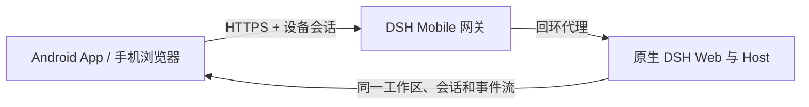

<p align="center">
  
</p>

<h1 align="center">DSH Mobile</h1>

<p align="center">在手机上安全、实时地使用电脑中的 DeepSeek Harness。</p>

<p align="center">
  <a href="https://www.npmjs.com/package/dsh-mobile"></a>
  <a href="https://github.com/saya-ch/dsh-mobile/actions/workflows/ci.yml"></a>
  <a href="https://github.com/saya-ch/dsh-mobile/releases"></a>
  <a href="LICENSE"></a>
</p>

<p align="center">
  <a href="#快速开始">快速开始</a> ·
  <a href="#连接方式">连接方式</a> ·
  <a href="#自定义移动布局与功能">自定义</a> ·
  <a href="README.en.md">English</a>
</p>

> Alpha 版本，当前原生 App 仅支持 Android；iOS 客户端仍为未发布的本地开发实验，不进入构建与 Release。本项目为 DeepSeek Harness 社区插件。

<p align="center"><a href="https://github.com/saya-ch/dsh-mobile/releases"><strong>下载 Android App</strong></a></p>

DSH Mobile 为 DeepSeek Harness 提供移动端界面适配与交互优化，采用专属移动端布局，并复用原生的对话、工作区、设置和插件组件。它通过受保护的局域网 HTTPS 网关，让 Android App 或手机浏览器访问电脑端同一份工作区、会话、消息和运行状态。

## 能做什么

- 在手机上继续使用电脑端的 DSH：会话、工作区、消息、工具和设置实时同步。
- 使用专属移动布局，适配侧边栏、输入栏、工具详情、设置和工作区选择。
- 通过 Android App 或手机浏览器访问同一个安全的局域网网关，自动发现设备并适应 IP 变化。
- 在 DeepSeek Harness 对话中直接修改移动端布局、交互和功能，保存后手机约一秒内刷新。
- 自定义不局限于样式：可以添加快捷操作、状态面板、语音、相机、扫码或其他同源网页功能。

## 快速开始

已经安装 `dsh` 命令：

```powershell
dsh plugin --profile web add dsh-mobile@alpha
dsh plugin --profile web exec dsh-mobile setup
dsh --profile web
```

直接使用 DeepSeek Harness 源码：

```powershell
corepack enable; pnpm install
pnpm dsh plugin --profile web add dsh-mobile@alpha
pnpm dsh plugin --profile web exec dsh-mobile setup
pnpm dsh --profile web
```

`setup` 会自动选择并记住当前局域网。切换 Wi-Fi、热点或 IP 后通常会自动恢复；仅在自动选择失败时使用 `--address 192.168.x.x`。

启动后：

1. 在 DeepSeek Harness 左下角打开“移动访问”，确认功能已开启。
2. 点击“生成并复制密钥”或“复制配对链接”，面板会显示配对二维码。
3. Android App 点击“扫码配对”，把手机对准电脑屏幕上的二维码即可完成配对；也可以点击“扫描”选择电脑后粘贴密钥或配对链接，无需手输 43 位密钥。
4. 配对完成后会建立持久设备信任，以后打开 App 无需重复输入。

插件不会修改 DeepSeek Harness 源码。设置、证书、设备和自定义文件保存在 `$DSH_HOME/mobile-access/`。

## 连接方式


| 方式        | 适合场景         | 说明                                     |
| ------------- | ------------------ | ------------------------------------------ |
| Android App | 日常使用         | 自动发现、无浏览器栏、App 内私有证书固定 |
| 手机浏览器  | 临时或跨平台访问 | 打开“移动访问”卡片显示的 HTTPS 地址    |

Android 同时使用 mDNS/NSD、UDP 公告、主动 UDP 查询和 HTTPS 探测发现 DeepSeek Harness。发现广播设备名、地址、端口、协议版本和稳定 `instanceId`，不会广播密钥或令牌。

App 配对后保存可撤销的设备凭据和私有证书信任；Wi-Fi、热点或 DHCP 导致 IP 变化时不需要重新配对。手机浏览器不能使用 App 的私有信任，因此需要浏览器本身信任该 HTTPS 证书。

新浏览器首次访问时，在电脑端开启配对，然后点击“复制配对链接”并把链接发到手机浏览器打开，配对码会自动填入；也可以打开 HTTPS 地址中的 `/mobile-access/pair`，手动输入密钥最后一段的 43 位配对码。配对完成后，浏览器会保存可撤销的设备凭据。

## 移动端界面

手机端使用插件自带的独立布局外壳，主布局不再依赖桌面三栏 DOM；原生功能组件保留少量移动端适配。你也可以通过“自定义移动布局与功能”继续调整页面结构并扩展交互：

- 左上角打开工作区与会话抽屉。
- 对话、轨迹、工具详情和 Session log 保持原有能力。
- 设置页使用顶部分类和单列内容。
- 输入栏保留命令、权限、模型、上下文、图片和发送控件。
- “添加工作区”在手机上展示电脑目录，不会在电脑上弹系统选择器。

Android App 只是 Kotlin WebView 薄壳，不内置另一份网页。手机浏览器访问的也是同一页面。

需要排查兼容性时，可在浏览器地址后追加 `?frontend=stock`，临时回到旧的桌面页面适配模式。

## 自定义移动布局与功能

自定义程度：你可以自由布置移动端的布局、交互和功能，而不必局限于默认样式。

直接在 DeepSeek Harness 对话中提出修改即可。默认文件：

```text
$DSH_HOME/mobile-access/mobile.css
$DSH_HOME/mobile-access/mobile.js
```

例如对 DeepSeek Harness 说：

```text
请编辑 $DSH_HOME/mobile-access/mobile.css 和 mobile.js，
把移动端改成适合单手操作的开发控制台：增加底部快捷指令、
会话状态面板和长按语音入口。只影响窄屏，不修改 DSH 源码。
```

保存后，已打开的 App 和浏览器通常会在一秒内应用变化。自定义能力不限于配色：`mobile.js` 可以添加导航、快捷操作、状态面板、相机、语音、扫码，以及调用同源 DSH API 的完整交互。

## 工作原理



插件包含两部分：Host face 提供发现、配对、HTTPS 和回环代理；Client face 替换移动端的布局入口，并复用原生功能插件。DeepSeek Harness 的源码和 3080 桌面页面都不会被修改，安装和卸载仍完全通过插件机制完成。

## 兼容性


| DSH Mobile       | 已验证的 DeepSeek Harness                |
| ------------------ | ------------------------------------------ |
| `0.1.0-alpha.28` | `0.1.0-rc.5`、`0.1.0-rc.6`、`0.1.0-rc.7` |

插件会在启动时检查 DSH Host 版本和移动布局所需的前端依赖；遇到未经验证的版本会直接给出错误，不会带着不兼容页面继续启动。CI 也会持续检查 DSH 主分支的布局插槽和移动端语义标记。升级 DSH 后如遇兼容提示，请先升级 DSH Mobile。

## 安全

- 仅在可信家庭、办公局域网或可信 VPN 中使用，不要转发到公网。
- 配对设备拥有控制电脑端 DeepSeek Harness 的能力，应视为完全可信设备。
- 移动网关开启时才监听局域网；关闭后 DeepSeek Harness 仍正常在电脑本机运行。
- 丢失手机后应在电脑端撤销设备。

完整说明见 [SECURITY.md](SECURITY.md)。

## 卸载

保留设备和自定义数据：

```powershell
dsh plugin --profile web remove dsh-mobile
```

同时清除插件数据：

```powershell
dsh plugin --profile web exec dsh-mobile purge --yes
dsh plugin --profile web remove dsh-mobile
```

源码模式把上述 `dsh` 换成 `pnpm dsh`。

## 开发

```powershell
npm ci
npm run verify
```

Android 构建见 [App 文档](apps/mobile/README.zh-CN.md)。

Apache-2.0，详见 [LICENSE](LICENSE)。
